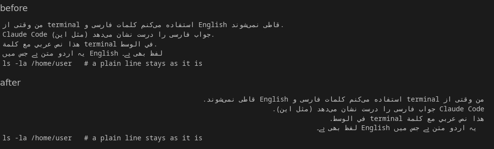

# cosmic-term-persian-arabic

A patch for the COSMIC terminal on Pop!_OS that shows Persian, Arabic, Urdu and other right-to-left text the way it should read. It helps most with command line tools that answer in full sentences, such as Claude Code, where Persian and English are mixed in one line.



## The problem

cosmic-term joins the letters correctly, but it lays out every line left to right. In a Persian sentence with an English word in the middle, the Persian parts end up in reverse order and the full stop lands at the wrong end. GNOME Terminal can fix this with an escape code. cosmic-term has no setting for it.

## What the patch does

- A line that contains Persian or Arabic letters is laid out right to left and starts at the right edge.
- A line that starts with more than 5 English words stays left to right, so output like `ls -l` with a Persian file name keeps its columns.
- Lines without right-to-left letters are not touched.
- Selecting text with the mouse picks the letters under the pointer on these lines.
- Brackets are no longer reversed with fonts from the Menlo family (Meslo and others).

## Install

You need git, cargo (Rust 1.93 or newer) and pkg-config. No root access is needed.

```bash
git clone https://github.com/rezainet/cosmic-term-persian-arabic.git
cd cosmic-term-persian-arabic
./install.sh
```

The script downloads the cosmic-term source, applies the patch, builds it and puts the result in `~/.local/bin/cosmic-term`. The first build takes a few minutes and about 2 GB of disk space in `build/`. Open a new terminal window afterwards.

Run `./install.sh` again after a system update of cosmic-term.

## Undo

```bash
rm ~/.local/bin/cosmic-term
```

The terminal that came with the system is never changed.

## Settings

| Variable | Effect |
|---|---|
| `COSMIC_TERM_BIDI_AUTODETECT=0` | every line left to right, as before |
| `COSMIC_TERM_BIDI_LTR_WORDS=8` | change the limit of 5 English words |

## Notes

- Tested on Pop!_OS 24.04 with cosmic-term 1.9.0 (commit 9129277). On other systems set `COSMIC_TERM_REF` to the commit or tag you want to build.
- A whole line is mirrored. A narrow box or table with one Persian row can look broken.
- `main()` after Persian text shows as `()main`. That is how the Unicode rules order it, and other terminals do the same.
- The window for input methods (IBus, Fcitx) is not placed correctly on mirrored lines yet. A normal Persian keyboard layout is not affected.
- I wrote this with the help of an AI assistant and tested it on my own machine.
- How it works inside: [docs/how-it-works.md](docs/how-it-works.md)

## License

GPL-3.0-only, the same as cosmic-term.
